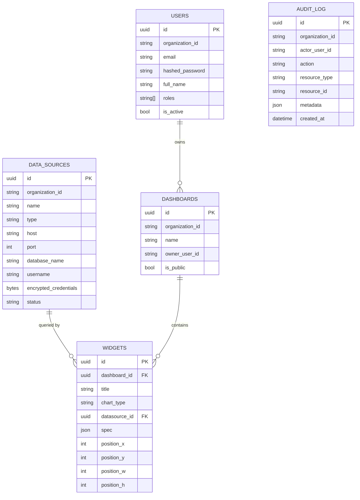

# Архитектура BI-платформы

Статус: базовый каркас (v0.1), спроектирован для последующего роста до
10+ ТБ аналитических данных и 1000+ одновременных пользователей.

## 1. Стек

| Слой | Технология |
|---|---|
| Backend | Python 3.11+, FastAPI, async SQLAlchemy 2.0, Pydantic 2 |
| Очереди/воркеры | arq (Redis-backed) |
| Frontend | React 18, TypeScript, Vite, Recharts, TanStack Query |
| БД метаданных платформы | PostgreSQL 15+ (через PgBouncer в проде) |
| Кэш / очереди | Redis 7+ |
| Аналитическое хранилище (данные клиента) | PostgreSQL и/или ClickHouse — через коннекторы |
| Миграции | Alembic (async) |
| Наблюдаемость | structlog (JSON-логи), Prometheus, OpenTelemetry-hook |
| Контейнеризация | Docker, Kubernetes (Deployment + HPA) |

## 2. Модульная Clean Architecture

Каждый бизнес-модуль (`auth`, `datasources`, `dashboards`) — это
самодостаточный вертикальный срез с четырьмя слоями:

```
modules/<module>/
  domain/           # Entities, Value Objects, репозитории-протоколы, доменные исключения.
                     # Ничего не знает о FastAPI/SQLAlchemy/Pydantic.
  application/       # Use cases (по одному классу на операцию) + DTO.
                     # Оркестрирует domain + repository-протоколы. Тестируется без БД.
  infrastructure/    # SQLAlchemy ORM-модели, реализации репозиториев,
                     # внешние клиенты (коннекторы БД, шифрование, кэш).
  presentation/      # FastAPI router, Pydantic-схемы, DI (зависимости),
                     # RBAC-гварды. Единственный слой, знающий про HTTP.
```

Правило зависимостей — только внутрь: `presentation → application → domain`,
`infrastructure` реализует интерфейсы `domain`, но сам не знает о
`application`/`presentation`. Модули общаются друг с другом только через
*публичные* интерфейсы (`domain.repositories`, `infrastructure.connectors`,
`application.use_cases`) — например, `dashboards` использует
`datasources.domain.repositories.DataSourceRepository`, но никогда не
импортирует `datasources.presentation`. Это модульный монолит с чёткими
границами, из которого при необходимости легко выделить отдельный сервис
(например, `datasources` — в отдельный microservice с собственным API), не
переписывая бизнес-логику.

`core/` и `shared/` — общий фундамент: `shared/domain.py` (Entity/AggregateRoot
база), `shared/repository.py` (протоколы), `core/database.py`
(SQLAlchemy engine + Unit of Work), `core/security.py` (JWT/пароли),
`core/cache.py` (Redis), `core/exceptions.py` → `core/error_handlers.py`
(единая трансляция доменных ошибок в HTTP).

## 3. ER-диаграмма (метаданные платформы)



Ключевой архитектурный выбор: **метаданные платформы** (пользователи,
дашборды, конфиги источников) хранятся в собственном небольшом Postgres и
масштабируются как обычная OLTP-нагрузка. **Аналитические данные**
(миллиарды строк, 10+ ТБ) никогда не копируются в эту БД — платформа всегда
исполняет запрос "на лету" против клиентского хранилища через коннектор
(`datasources/infrastructure/connectors/*`), с результатом, закэшированным в
Redis. Это радикально упрощает масштабирование самой платформы: её
собственная БД остаётся маленькой независимо от объёма клиентских данных.

## 4. Поток исполнения виджета (пример горячего пути)

```
GET /dashboards/{id}/widgets/{id}/data
  → GetWidgetDataUseCase
      1. читает Dashboard/Widget из репозитория (метаданные, быстро)
      2. строит query fingerprint (table+dimension+measure+agg+filters)
      3. Redis GET по детерминированному ключу — HIT: отдаём сразу
      4. MISS: резолвим DataSource → ConnectorRegistry.get(type)
      5. QueryCompiler: AggregationSpec → безопасный параметризованный QuerySpec
         (идентификаторы — allow-list + quoting, значения — bind params, никогда
         конкатенация пользовательского ввода в SQL)
      6. Connector.execute_query() — асинхронно, с лимитом строк
      7. Redis SETEX (TTL по умолчанию 5 мин) + Prometheus-метрика длительности
```

## 5. Стратегия масштабирования (10+ ТБ / 1000+ одновременных пользователей)

**Уровень API (stateless):**
- Каждый под FastAPI не хранит состояние сессии (JWT bearer) → горизонтальное
  масштабирование через обычный `Deployment` + `HorizontalPodAutoscaler`
  (см. `deploy/k8s/api-deployment.yaml`), без sticky-sessions.
- Пул соединений к Postgres на уровне процесса ограничен (`DATABASE_POOL_SIZE`);
  в проде — `PgBouncer` в режиме `transaction pooling` перед реальным Postgres,
  чтобы сотни подов API не упирались в `max_connections` БД.

**Уровень БД метаданных:**
- Остаётся маленькой (пользователи/дашборды/конфиги), не растёт вместе с
  клиентскими данными → read-реплики нужны не для объёма, а для отказоустойчивости
  и разгрузки списковых эндпоинтов (`GET /dashboards`).
- Индексы по `organization_id` на всех таблицах — мультитенантные запросы
  всегда фильтруются по тенанту первым делом.

**Уровень аналитических данных (10+ ТБ):**
- Тяжёлые агрегации выполняются НЕ в Postgres-метаданных, а в клиентском
  хранилище через коннектор. Для реального объёма 10+ ТБ рекомендуемый
  бэкенд — **ClickHouse** (колоночное хранение, sub-second агрегации по
  миллиардам строк) вместо row-store Postgres.
- `QuerySpec.row_limit` — жёсткий лимит строк на запрос (защита от
  "убийственного" виджета), плюс `truncated`-флаг в ответе, чтобы UI явно
  показывал усечение.
- Кэширование результата запроса в Redis (`QUERY_CACHE_TTL_SECONDS`,
  по умолчанию 5 мин) — большинство дашбордов просматриваются многими
  пользователями с одинаковыми фильтрами, кэш снимает повторную нагрузку с
  хранилища почти полностью.
- Фоновый воркер (`arq`, см. `src/worker.py`) может проактивно "прогревать"
  кэш популярных дашбордов по расписанию — виджет никогда не бьёт в холодный
  кэш на глазах у первого зрителя.

**Уровень кэша/очередей:**
- Redis — отдельный managed-кластер (не в поде рядом с API), с репликацией;
  на 1000+ одновременных пользователей учитывать sharding (Redis Cluster)
  при росте объёма кэшируемых результатов.

**Наблюдаемость на масштабе:**
- `core/metrics.py` — Prometheus-метрики HTTP-латентности и отдельно
  `dashboard_query_duration_seconds` с лейблом `cache_status` — сразу видно,
  сколько трафика реально доходит до тяжёлых источников, а не до кэша.
- structlog JSON-логи с `request_id` — корреляция запроса через все слои,
  готово к агрегации в ELK/Loki.
- `OTEL_EXPORTER_OTLP_ENDPOINT` — точка расширения для распределённого
  трейсинга (не подключено в этом скелете, но конфиг уже заложен).

**Безопасность на масштабе:**
- Секреты подключения к клиентским БД шифруются (Fernet) до попадания в
  репозиторий — исключает утечку через дамп БД метаданных.
- RBAC (`Permission`/`SystemRole`) проверяется на уровне `presentation`
  единым `RequirePermission`-гвардом, переиспользуемым во всех модулях.
- Каждая таблица метаданных содержит `organization_id` — row-level
  multi-tenancy на уровне запросов репозитория (расширяется до Postgres
  RLS-политик как следующий шаг для defense-in-depth).

## 6. Что сознательно оставлено как заглушка/TODO

Поскольку это широкий каркас "по чуть-чуть везде", ряд вещей обозначен как
точка расширения, а не реализован полностью:
- Коннекторы MySQL и CSV-загрузки — интерфейс `Connector` есть, реализация
  по аналогии с `postgres.py`/`clickhouse.py`.
- Audit log — таблица создана миграцией, но запись в неё (application-layer
  decorator/event listener) не подключена.
- Ротация ключа шифрования датасорсов (`DATASOURCE_ENCRYPTION_KEY`).
- Django/Postgres Row-Level Security как второй рубеж мультитенантности.
- Полноценный drag-n-drop конструктор дашбордов на фронтенде — сейчас
  `position: {x,y,w,h}` уже в модели данных, но визуального grid-редактора
  нет, только рендер готовой сетки.

## 7. OpenAPI/Swagger

Каждый endpoint в `presentation/router.py` документирован через `summary`,
`description` и `responses` — полная интерактивная документация доступна на
`/docs` (Swagger UI) и `/redoc` при поднятом API (см. `src/main.py`).
